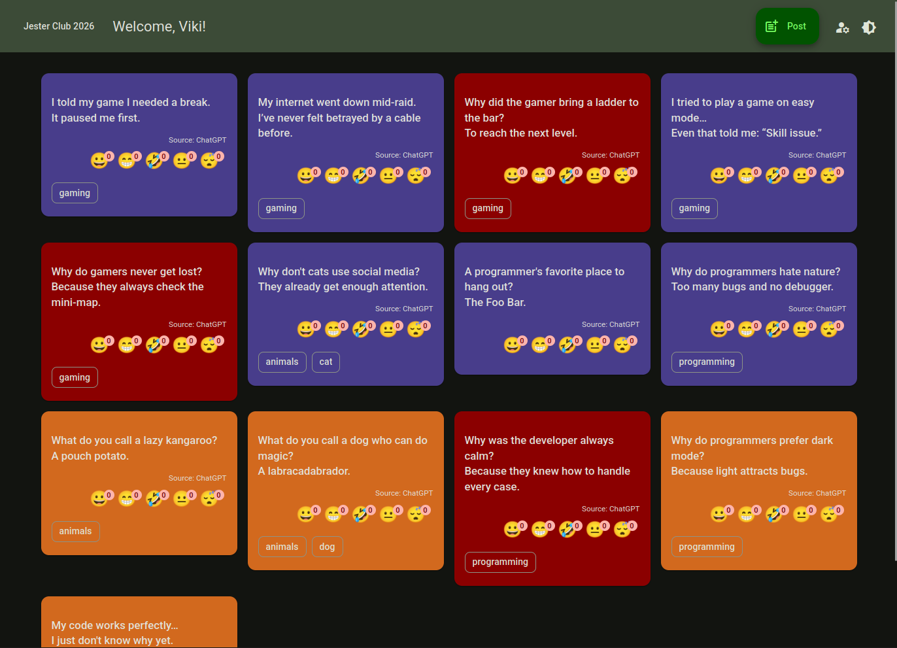

# Jester Club 2026 Web Site

Jester Club 2026 is a **multilayered social web application** focused on sharing and managing jokes.

This project is a **modern rewrite and architectural refresh** of my earlier _Jester Club_ application, rebuilt using:

- an **Microsoft SQL Server** database
- **.NET 10** with contemporary backend design principles for the REST API
- **Angular 21** with **Angular Material** components for the web client

⚠️ **Note:**  
This is **not a finished product**. The primary goal of this repository is to **demonstrate the planned architecture, layering, and design decisions** behind the application.

## Technical Overview

The application follows a **layered (enterprise-style) architecture** with a clear separation of concerns.

## Backend Layers

### Database Access Layer

- Responsible for **all database access**
- Uses **Microsoft SQL Server**
- Implemented with **Entity Framework Core (Code First)**
- Contains:
  - EF Core entities
  - DbContext
  - Database-specific query providers / repositories
- Has **no dependency** on DTOs or Web API concepts

### Data Service Layer

- Acts as an **application/service layer**
- Communicates with the Database Access Layer
- Responsible for:
  - Business logic
  - Data aggregation
  - Mapping database entities to DTOs
- Provides clean, API-ready data structures for the Web API layer

### RESTful Service Layer

- Implemented using **ASP.NET Core 10 Web API**
- Exposes the application functionality via **REST endpoints**
- Responsibilities:
  - Request handling
  - Input validation
  - HTTP response generation
  - Dependency injection configuration
- Does **not** contain database-specific logic

## Frontend Layer

### Angular Web Client

The **Angular Web Client** is the front-end of the Jester Club 2026 website. It provides an interactive interface for users to browse, create, and update jokes. The client communicates with the backend via RESTful Web API calls and handles client-side data transformation, form validation, and navigation.

This project was generated using [Angular CLI](https://github.com/angular/angular-cli) version 21.1.2 and leverages **Angular Material** components for consistent and responsive UI design. The application follows a modular architecture, separating pages, layout components, services, and interfaces to ensure maintainability and scalability.

#### Key Features

- Joke listing
- Light and dark mode switch
- Fake user authentication
- Joke emotional reaction handling
- Joke insertion
- Joke update

### React Webclient

The **React Web Client** is the front-end of the Jester Club 2026 website. It provides an interactive interface for users to browse, create, and update jokes. The client communicates with the backend via RESTful Web API calls and handles client-side data transformation, form validation, and navigation.

This is a **[Next.js 16.1](https://nextjs.org)** project bootstrapped with [`create-next-app`](https://nextjs.org/docs/app/api-reference/cli/create-next-app) and leverages **MUI 7.3** components for consistent and responsive UI design. The application follows a modular architecture, separating pages, layout components, services, and interfaces to ensure maintainability and scalability.

#### Key Features

- Joke listing
- Light and dark mode switch
- Fake user authentication
- Joke emotional reaction handling
- Joke insertion
- Joke update

## Goals of This Project

- Demonstrate a **clean, maintainable, enterprise-style architecture**
- Apply modern **.NET, EF Core, and Web API best practices**
- Serve as a **learning and reference project** rather than a production-ready system

## Technical documentation

The technical documantation for this project can be found in the **jcdocs** folder [here](jcdocs/README.md).
