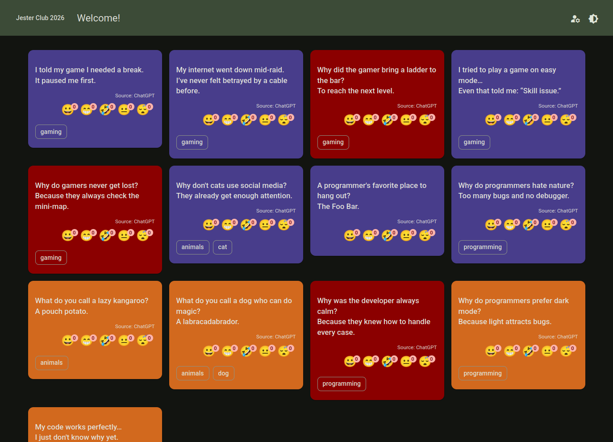

# Jester Club 2026 Technical Documentation

The Jester Club 2026 project is a web application for managing and sharing jokes. 
It follows a multi-layered architecture with a **SQL Server database**, **ASP.NET Core Web API** backend, and an **Angular 21** front-end.

This documentation describes the architecture, project structure, and key implementation details. 
Screenshots of the application can be found in the **screenshots** folder.

## Backend Documentation

- [Database Structure](docs/databasestructure.md) – Overview of the SQL Server database schema.
- [Database Access Project](docs/databaseaccessproject.md) – EF Core entities and database providers.
- [Data Service Project](docs/dataserviceproject.md) – Application/service layer, business logic and DTO mapping.
- [ASP.NET Web API Project](docs/webapiproject.md) – RESTful API layer exposing endpoints.

## Frontend Documentation

- [Angular 21 Web Client Project](docs/angularwebclientproject.md) – The Angular client application with pages, services, and UI components.

