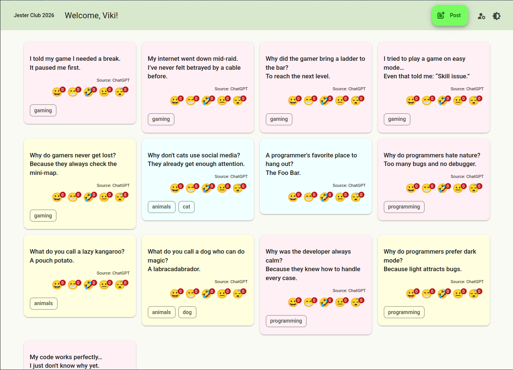
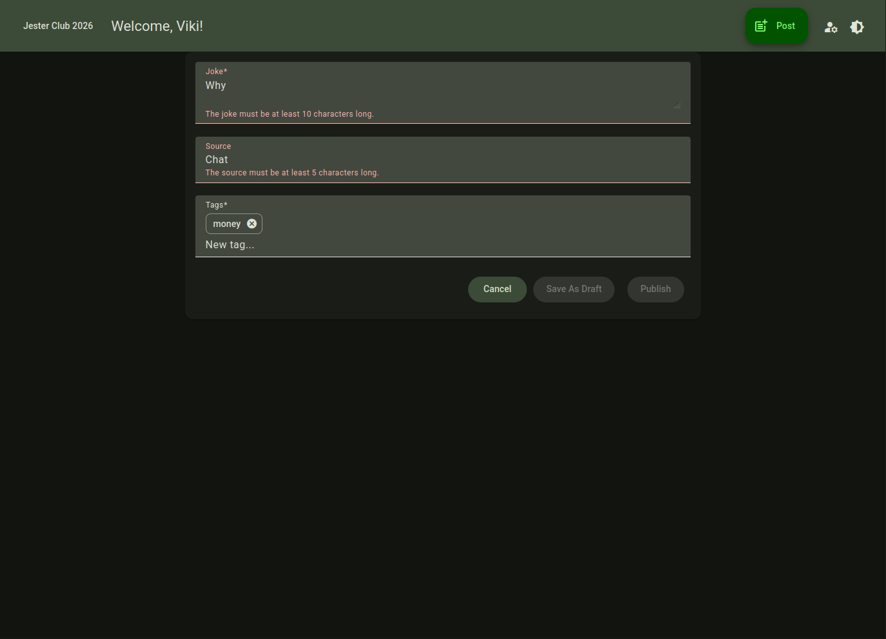

# Angular 21 Web Client Project

The **Angular Web Client** is the front-end of the Jester Club 2026 website. It provides an interactive interface for users to browse, create, and update jokes. The client communicates with the backend via RESTful Web API calls and handles client-side data transformation, form validation, and navigation.

This project was generated using [Angular CLI](https://github.com/angular/angular-cli) version 21.1.2 and leverages **Angular Material** components for consistent and responsive UI design. The application follows a modular architecture, separating pages, layout components, services, and interfaces to ensure maintainability and scalability.

## Key Features

- Joke listing
- Fake user authentication
- Joke insertion
- Joke update

## Location

This project can be found in the **jcangularwebclient** folder.

## Project Structure

All source code is located in the **src/app** folder, organized as follows:

- **interfaces** folder: Contains the DTOs used for client-server communication.
- **layout** folder: Contains layout components, such as the *Add Joke* button and the *User Welcome* component.
- **pages** folder: Contains routed page components, such as the *Joke List* and the *Joke Form* components.
- **services** folder: Contains services for fake user authentication, joke listing, and joke editing.

## Screenshots

**Homepage (no user signed in):**  

**Homepage (light theme, user signed in):**  

**Add Joke screen with form validation:**  

