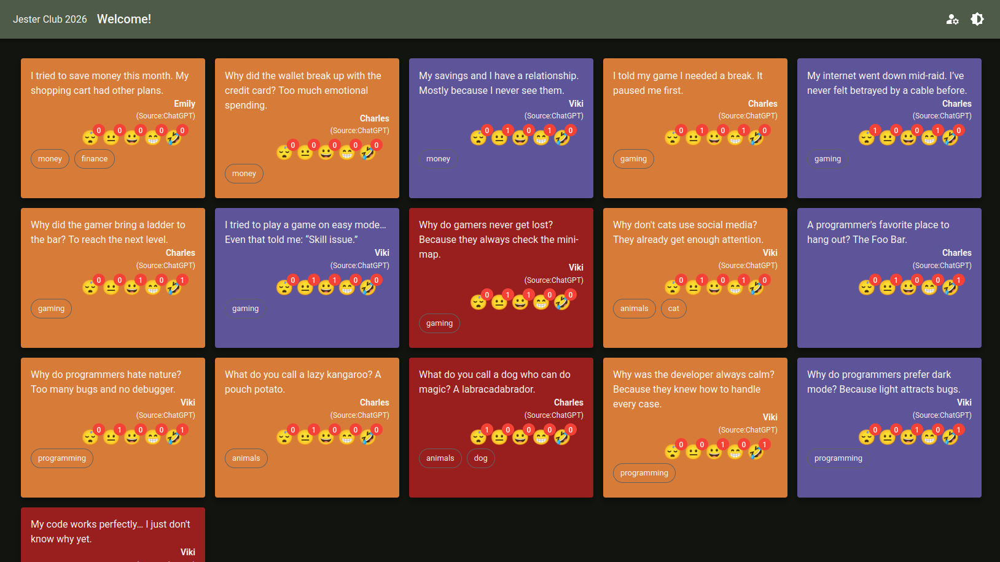
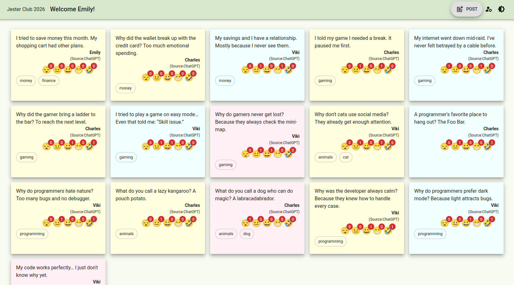
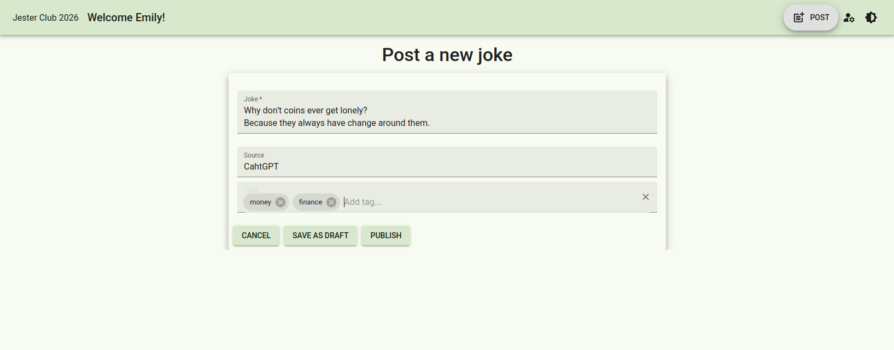

# React Web Client Project

The **React Web Client** is the front-end of the Jester Club 2026 website. It provides an interactive interface for users to browse, create, and update jokes. The client communicates with the backend via RESTful Web API calls and handles client-side data transformation, form validation, and navigation.

This is a **[Next.js 16.1](https://nextjs.org)** project bootstrapped with [`create-next-app`](https://nextjs.org/docs/app/api-reference/cli/create-next-app) and leverages **MUI 7.3** components for consistent and responsive UI design. The application follows a modular architecture, separating pages, layout components, services, and interfaces to ensure maintainability and scalability.

## Key Features

- Joke listing
- Fake user authentication
- Joke emotional reaction handling
- Joke insertion
- Joke update

## Location

This project can be found in the **jcreactwebclient** folder.

## Project Structure

All source code is located in the **src** folder, organized as follows:

- **app** folder: Contains the pages that are used for navigation.
- **components** folder: Contains layout components, such as the _Add Joke_ button and the _User Welcome_ component.
- **interfaces** folder: Contains the DTOs used for client-server communication.
- **lib** folder: Contains services for fake user authentication, joke listing, and joke editing.
- **theme** folder: Contains the theme definition for the application.
- **types** folder: Contains types used for client-server communication.

## Screenshots

**Homepage (no user signed in):**  

**Homepage (light theme, user signed in):**  

**Add Joke screen:**  

